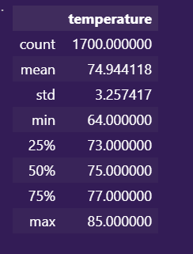
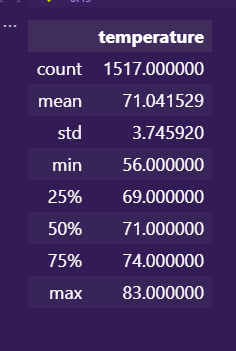

# Module 9: Challenge

## Overview of the Analysis

This is analysis is made to check the temperatures in two different months in different years, specifically we made an analysis of two months **December** and **June**. 
We are going to be able to see the avarage temperatures, the minimum and maximum and other values that can be described by the retreived information.

## Results

As shown in the results we can see that June is the hottest month of the year in this location, because of the comparition between the max temperature in both months. In June the maximum temperature is 85 and December is 83, there is a difference of 2 degrees but the minimum temperature has a bigger difference.

**Month of June**

**Month of December**

## Summary

As we can see, there are more temperatures in the month of June than the month of December, and this can make a significant difference when we try to compare this two months. but definitely we can say that June month is the hottest one even though it max temperature is only two degrees above the December max temperature.

### Two queries to gather more information

We can determine a year so this way we only can see this months on a defined year: 

    session.query(Measurement.date, Measurement.tobs).\
    filter(extract('month',Measurement.date) == 12).\
    filter(extract('year',Measurement.date) == year).all()

Another way to retrieve and compare the information of this two months is to set only a number of results for this month so we can see the same number of days in both months.

    session.query(Measurement.date, Measurement.tobs).\
    filter(extract('month',Measurement.date) == 12).\
    limit(1500).all()
